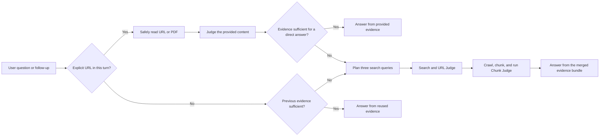

# Simplex

Simplex is an open-source research search tool built around speed, evidence quality, and traceability. It combines SearXNG, multi-source search, LLM Judges, Crawl4AI crawling, PDF extraction, and cited answers into one local research pipeline.

[繁體中文入口](README.md) · [繁體中文技術文件](docs/TECHNICAL_GUIDE.zh-TW.md) · [English technical guide](docs/TECHNICAL_GUIDE.en.md)

## Highlights

- Choose among `instant`, `fast`, and `full` research depths to balance speed and coverage.
- Search snippets are used only for Judge selection; final answers use evidence chunks extracted from crawled pages and retain clickable citations.
- When a user provides URLs, Simplex reads those pages first. It answers directly when the evidence is sufficient and falls back to normal research when it is not.
- Supports follow-up conversations with controlled history and encrypted evidence capsules; ordinary follow-ups do not resend the entire previous tool output.
- Separates the question/answer model from the Judge model and supports OpenRouter, OpenAI, DeepSeek, Groq, Mistral, NVIDIA NIM, and OpenAI-compatible providers.
- Supports Web, Academic, and Social search modes, PDF main-text extraction, OCR, and English, Traditional Chinese, Simplified Chinese, and Japanese content.
- Includes dark/light themes, English/Traditional Chinese localization, a model pool, and an expandable research trace.

## Core flow



## Quick start

Requirements: Python 3.11+, Git, and Node.js/npm.

```bash
./simplex install
./simplex start
```

Open <http://127.0.0.1:8787/> and configure the question model and Judge model in Settings. Local services bind to `127.0.0.1` only.

For Docker:

```bash
docker compose up --build
```

## Documentation

- [繁體中文技術文件](docs/TECHNICAL_GUIDE.zh-TW.md): installation, configuration, pipeline, conversation context, PDF handling, API, security, and tests.
- [English technical guide](docs/TECHNICAL_GUIDE.en.md): the complete English technical and operational guide.
- [PDF chunk diagnosis](docs/pdf-chunk-diagnosis-jas-hkbu.md): a case study of PDF main-text extraction and chunk quality.

## License

Simplex is released under the [MIT License](LICENSE). SearXNG is an independent service under AGPL-3.0-or-later; see [THIRD_PARTY_NOTICES.md](THIRD_PARTY_NOTICES.md) for dependency and redistribution notes.
