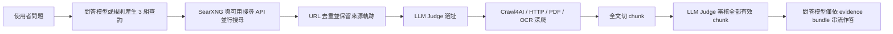

# Simplex

Simplex 是一套速度與證據品質優先的開源研究搜尋工具。它把 SearXNG、可替換的搜尋 API、LLM Judge、Crawl4AI 深爬與引用回答包成同一個 Web 產品，並在搜尋後保持可供驗證的citation。

## 主要能力

- 原生 SearXNG 搜尋基建，不填任何商業搜尋 API Key 也能開始使用。
- `web`、`academic`、`social` 三種搜尋：學術與社群模式都同時保留一般 Web 搜尋，再加入 SearXNG `science` 或 `social media` 分流。
- SearXNG 保留頁面既有排序，每組 query 最多取前 30 筆；三組 query 最多送入 90 筆搜尋結果。
- Brave、Tavily、Exa、SerpApi 與任意 JSON 搜尋 API 可在設定頁加入；缺少某類專用服務時，查詢仍會導向可用服務，不會靜默放棄。
- 問答模型與 Judge 模型可分開選擇。支援 OpenRouter、OpenAI、DeepSeek、Groq、Mistral、NVIDIA NIM，以及 OpenAI-compatible 自定義 Provider。
- 回答模型採 OpenAI-compatible 串流；研究完成後立即逐段送到前端，不必等待整篇答案生成完畢。前端會在合理字數邊界讓出瀏覽器繪製 frame，避免同一批網路資料中的多個 delta 被 React 自動批次合併成一次畫面更新。
- Provider API Key 儲存在本機 SQLite 的 Fernet 加密資料中；設定 API 不回傳明文密鑰。
- Crawl4AI、Playwright、Patchright、PDF 解析與 Tesseract OCR 一併安裝，JS 頁面與掃描 PDF 可開箱使用。
- React PWA 前端支援深色 Liquid Glass、淺色 Apple 首頁風格及 80%–135% 的整體 UI 等比縮放；手機窄螢幕在最大縮放下也會重新排版。
- Docker 與非 Docker 安裝皆提供單一入口；Web 前後端與 SearXNG 不需要分別啟動。

## 快速開始

### macOS / Linux 原生安裝

需求：Python 3.11 以上、Git、Node.js/npm。macOS 建議先安裝 Homebrew；Linux 安裝器會在 root 環境直接使用 apt，非 root 時才使用 `sudo` 補齊 Chromium 與 Tesseract 系統依賴。

```bash
./simplex install
./simplex start
```

前端採用內容雜湊的靜態資產；入口頁與 Service Worker 會要求瀏覽器重新驗證。每次啟動都使用乾淨的 `http://127.0.0.1:8787/`，不在公開網址加入建置或測試參數。

macOS 也可以直接雙擊：

- `Simplex Search.command`：首次使用會自動安裝，之後直接啟動完整服務。

若 Simplex 已在執行，再次雙擊啟動器只會用新分頁重新載入乾淨的 `http://127.0.0.1:8787/`；不會終止既有服務，也不會在網址附加版本或測試參數。

安裝器會建立兩個隔離環境：`.venv` 給 Simplex、`.runtime/searxng-venv` 給固定版本的 SearXNG，並下載 Playwright 與 Patchright Chromium。啟動器會先檢查連接埠，只綁定：

- Simplex Web：`http://127.0.0.1:8787`
- SearXNG 內部服務：`http://127.0.0.1:8888`

若 8888 已被占用，啟動器會先驗證對方是否真的是 SearXNG；不會把任意程序誤當搜尋基建。

若要檢查安裝完整性：

```bash
./simplex doctor
```

### Docker Compose

```bash
docker compose up --build
```

完成後開啟 `http://127.0.0.1:8787`。Compose 只把容器內的代理埠 `8788` 暴露在宿主機回環介面；SearXNG 留在容器內部網路。正式長期使用前建議在 `.env` 設定隨機 `SEARXNG_SECRET`。

停止服務：

```bash
docker compose down
```

## 第一次設定

開啟右上角「設定」：

1. 在「模型」中填入 Provider API Key，先儲存，再按「同步模型」。
2. 分別選擇「問答模型」與「搜尋 Judge 模型」。問答模型負責規劃三組查詢與串流撰寫引用回答；Judge 在 `instant`、`fast`、`full` 都負責語意選址、chunk 選擇與充分性判斷，且中間 Judge 固定關閉 reasoning。
3. 在「搜尋服務」選擇「原生 SearXNG」或「自有搜尋引擎」。SearXNG 是預設選項；只有切到自有模式後，才會展開商業 API 與自定義 JSON API 的地址、Key 和欄位設定。
4. 在「其他項目」選擇深／淺主題與整體 UI 比例。

未設定問答模型時，搜尋仍可運作，最後會以已深爬的引用來源清單降級輸出。未設定 Judge 時，Web 版會使用本地規則降級，且不會偷讀舊 `.env` 的 LLM Key。

搜尋引擎模式是互斥的：原生模式只把查詢交給 SearXNG；自有模式會由後端停用 SearXNG，並只使用用戶在該區啟用且完成設定的 Provider。切換不會刪除另一側已保存的設定。

### 自定義 LLM Provider

自定義 Provider 使用 OpenAI-compatible 協定，可設定：

- Base URL
- Models path（通常是 `/models`）
- Chat endpoint（通常是 `/chat/completions`）
- API Key

### 自定義搜尋 API

設定頁支援常見 JSON 搜尋介面：

- GET 或 POST
- Bearer、Header、Query 或無驗證
- Query / Count 欄位名稱
- 結果陣列的 JSON path
- title、url、snippet、published date 等欄位映射
- 每組 query 筆數，以及適用的 `web` / `academic` / `social` 模式

自定義介面會先依 `result_path` 取出結果陣列，再以欄位映射正規化；授權資料只在實際請求時加入 Header 或 Query。

## 搜尋路由與韌性

三組搜尋字詞都會派往當前模式的所有可用來源。內建路由如下：

| 模式 | SearXNG 原生分流 | 可選外部來源 |
|---|---|---|
| Web | 每組 query → `general` | Brave、Tavily、自定義 API |
| 學術 | 每組 query → `general` + `science` | Exa、SerpApi Scholar、Brave、自定義 API |
| 社群 | 每組 query → `general` + `social media` | Brave、Tavily、Exa、自定義 API |

外部搜尋 API 使用可重分配的 per-query 配額：例如只啟用 Tavily 時，三組 query 都會交給 Tavily；某個專用來源沒有 Key 時，其他已啟用來源仍會承接查詢。所有來源在每組 query 合併去重後最多保留 30 筆，避免三組搜尋產生超過 90 筆 Judge 候選。

同一 URL 從 general、science、social 或多個引擎返回時，Simplex 會去重內容並合併 `search_lane`、`source_engines` 等來源軌跡，不會丟失分流資訊。

## 研究管線



搜尋 snippets 只用於 Judge 選址，不是最終回答的事實來源。回答模型只接收被選中的 `evidence_bundle[].chunks[].text`；引用由 canonical source registry 統一編號。

執行模式：

- `instant`：單輪，深爬約 3–5 個 URL；沿用 V3 的 URL Judge 與 Chunk Judge，但不進行補搜迴圈。
- `fast`：若首輪不足，可再做一次輕量補搜。
- `full`：最多三輪，針對 Judge 指出的證據缺口補搜。

單頁爬取優先走快速 HTTP 正文抽取；互動頁、SPA 或品質不足時才啟動 Playwright / Patchright。PDF 先使用 PyMuPDF，再以 pypdf 後備；必要時使用 Tesseract OCR。

## 架構

```text
simplex_app/                  FastAPI、加密設定、模型探索、SSE 搜尋與前端託管
frontend/                     React + Vite + TypeScript PWA
deep_search_tool.py           搜尋路由、配額、Judge、chunk evidence 與研究編排
pro_search_crawl_backend.py   HTTP / JS / PDF 深爬核心
crawl4ai_pdf.py               PDF 解析與 OCR
searxng/settings.yml          原生一般、學術與社群搜尋設定
scripts/                      安裝器、doctor、雙服務 supervisor
pro_search_mcp.py             向下相容的 `pro_search` MCP server（顯示名稱已更新為 Simplex）
tests/                        可攜式回歸測試，不包含本機秘密或臨時產物
```

Web API：

- `GET /api/health`：SearXNG、爬蟲與 OCR 狀態。
- `GET /api/ready`：程序 readiness。
- `GET/PUT /api/settings`：讀取或儲存遮罩後設定。
- `GET /api/llm/providers/{id}/models`：從 Provider 同步模型。
- `POST /api/search-engines/{id}/test`：搜尋服務設定檢查。
- `POST /api/search/stream`：SSE 研究流程；依序發送狀態、`answer_start`、多個 `answer_delta`、最終 `result` 與 `done`。前端會在真實串流片段間讓出瀏覽器繪製時機，避免 React 將同批片段合併成一次顯示。結果中的 `timings` 分開記錄查詢規劃、純研究、回答首字、回答完成與全程時間。後端會辨識 Provider 的 error event 與未完成 EOF；部分串流會保留已收到內容並明確警告，使用者主動停止時前端也會標示「回答已停止（部分內容）」。

## MCP 相容模式

原有工具名稱 `pro_search`、參數與公開 payload 保持相容：

```bash
cp .env.example .env
.venv/bin/python pro_search_mcp.py
```

MCP 預設只綁定 `127.0.0.1:8074`。`.env` 只供 MCP 與 Python 直調相容路徑使用；Web 版請在設定頁管理 Provider 與 Key。

核心函式仍可直接呼叫：

```python
import asyncio
from deep_search_tool import deep_search

result = asyncio.run(deep_search(
    question="Python 3.11 有哪些效能改進？",
    search_queries=["Python 3.11 performance", "Faster CPython 3.11", "Python 3.11 benchmark"],
    search_mode="academic",
    mode="fast",
))
```

## 開發與測試

```bash
.venv/bin/python -m pip install -r requirements-dev.txt
.venv/bin/python -m pytest -q
npm --prefix frontend run lint
npm --prefix frontend run build
bash -n scripts/*.sh simplex "Simplex Search.command"
./simplex doctor
```

所有本機 server 都必須綁定 `127.0.0.1`。正式前端由 FastAPI 同一個 `8787` 服務提供，不需要另一個 Vite server；Vite 只供開發時使用。

## 資料與安全

- Web 設定存於 `data/settings.db`，整個設定 blob 使用 Fernet 加密。
- 主密鑰存於 `data/.settings.key`，建立時嘗試設為 `0600`。
- API 回傳永遠以空字串與 `has_api_key` 表示既有密鑰；送回空值不會清掉舊 Key。
- `data/`、`.runtime/`、`.venv/`、前端建置與測試產物已排除版本控制。
- `.venv/`、`.runtime/`、`frontend/node_modules/` 是安裝後的本機執行環境，不是專案原始碼，不會被推送到 GitHub。
- Simplex 僅為本機單使用者工具，尚未提供多租戶登入與權限隔離；不要直接把 8787 暴露到公網。
- Web 服務只接受 `127.0.0.1`、`localhost` Host，並拒絕跨站 Origin／Fetch Metadata 請求，降低 DNS rebinding 將已存密鑰轉送到惡意 Provider 的風險。
- 搜尋結果進入深爬前會解析 DNS 並拒絕私有、回環、link-local 與保留位址；HTTP redirect 每一跳都會在送出前重新驗證，避免搜尋結果被利用來讀取內網服務。
- 上述深爬限制只套用於搜尋結果；Simplex 自己連線到本機 SearXNG 的 `127.0.0.1:8888` 不受影響。

## 授權

Simplex 以 [MIT License](LICENSE) 開源。SearXNG 是獨立服務並使用 AGPL-3.0-or-later；其他相依元件與重新散布注意事項見 [THIRD_PARTY_NOTICES.md](THIRD_PARTY_NOTICES.md)。
