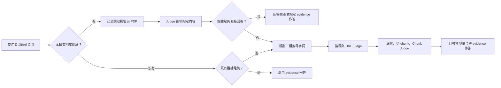

# Simplex

Simplex 是一套以速度、證據品質與可追溯性為核心的開源研究搜尋工具。它把 SearXNG、多來源搜尋、LLM Judge、Crawl4AI 深爬、PDF 解析與引用回答整合成一條本機研究管線。

[English](README.en.md) · [繁體中文技術文件](docs/TECHNICAL_GUIDE.zh-TW.md) · [English technical guide](docs/TECHNICAL_GUIDE.en.md)

## 主要特色

- 以 `instant`、`fast`、`full` 三種深度在速度與研究完整度之間取捨。
- 搜尋 snippets 只供 Judge 選址；最終回答只使用深爬後通過審核的 evidence chunks，並保留可點擊 citation。
- 使用者貼入網址時，先讀取指定頁面；內容充分就直接回答，不足才進入一般搜尋。
- 支援持續對話，保留受控的歷史訊息與加密 evidence capsule；一般追問不會重送全部舊工具輸出。
- 問答模型與 Judge 模型分工，可使用 OpenRouter、OpenAI、DeepSeek、Groq、Mistral、NVIDIA NIM 與 OpenAI-compatible Provider。
- 支援 Web、Academic、Social 搜尋模式、PDF 主文抽取、OCR，以及繁體中文、簡體中文、日文內容。
- 提供深色／淺色介面、英文／繁體中文切換、模型池與可展開的研究軌跡。

## 核心流程



## 快速開始

需求：Python 3.11 以上、Git、Node.js/npm。

```bash
./simplex install
./simplex start
```

開啟 <http://127.0.0.1:8787/>，再到 Settings 設定問答模型與 Judge 模型。所有本機服務只綁定 `127.0.0.1`。

Docker 使用者可執行：

```bash
docker compose up --build
```

## 文件導覽

- [繁體中文技術文件](docs/TECHNICAL_GUIDE.zh-TW.md)：安裝、設定、搜尋管線、對話上下文、PDF、API、安全與測試。
- [English technical guide](docs/TECHNICAL_GUIDE.en.md)：完整英文技術與操作說明。
- [PDF chunk 診斷報告](docs/pdf-chunk-diagnosis-jas-hkbu.md)：HKBU PDF 主文抽取與 chunk 問題的實例分析。

## 授權

Simplex 使用 [MIT License](LICENSE)。SearXNG 是獨立服務並使用 AGPL-3.0-or-later；其他相依元件與重新散布注意事項見 [THIRD_PARTY_NOTICES.md](THIRD_PARTY_NOTICES.md)。
